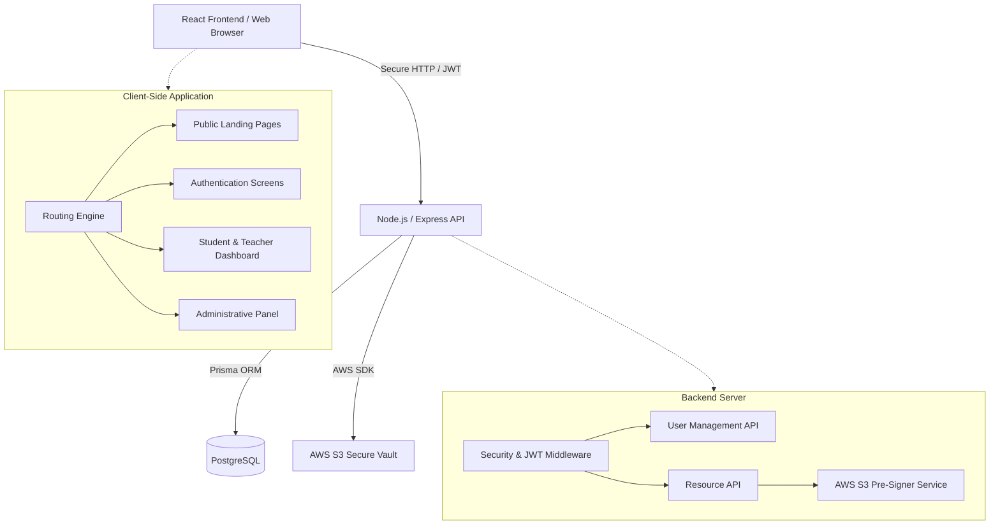

# 🏗️ Architecture & System Design Overview

This document outlines the technical architecture of the Hoot Educational Portal. It is designed to provide stakeholders and developers with a clear understanding of how the system operates, how data flows securely, and why specific technologies were chosen.

## System Architecture Diagram

---

## 🛠️ Technology Stack

The platform is built using modern, enterprise-grade technologies to ensure speed, security, and scalability.

### 1. Frontend (The User Interface)
- **Framework**: React 18. Provides a highly interactive, seamless Single Page Application (SPA) experience.
- **Build Tool**: Vite. Chosen over older tools like Webpack for its lightning-fast load times and optimized production bundles. Relies on the `VITE_API_URL` environment variable for seamless deployment bridging.
- **Routing**: React Router DOM. Handles secure navigation, ensuring unauthenticated users cannot access protected areas.
- **Styling**: Custom CSS. We utilized a completely bespoke CSS architecture to match the brand's exact aesthetic, avoiding generic templates.
- **PDF Rendering**: `react-pdf`. Used to render high-quality, custom-styled document viewers directly in the browser.

### 2. Backend (The API Server)
- **Runtime**: Node.js with Express.js. A lightweight, incredibly fast server environment perfect for handling hundreds of simultaneous student requests.
- **Authentication**: Custom JSON Web Tokens (JWT). We built a proprietary authentication system (removing third-party dependencies like Clerk) to give the Admin 100% control over user data and access expiration.
- **Security**: Heavily relies on `.env` protected keys (AWS, Postgres URL, JWT Secret) that are blocked by `.gitignore`.

### 3. Database & Storage (Data Persistence)
- **Database**: PostgreSQL (Ready for AWS RDS). A robust, enterprise-grade relational database chosen for its extreme reliability, data integrity, and scaling capabilities.
- **ORM**: Prisma. Acts as the bridge between the Node.js backend and the Postgres database, ensuring type-safe and highly optimized queries.
- **File Storage**: AWS S3 (Amazon Web Services). The absolute industry standard for secure cloud storage. All videos and PDFs are stored here under strict lock-and-key.

---

## 🔄 How the Data Flows

1. **User Login**: A student enters their credentials. The Frontend sends this securely to the Backend. The Backend verifies the password and checks the `expiresAt` date in the Postgres Database.
2. **Token Issuance**: If valid, the Backend issues a secure JWT (JSON Web Token) to the user's browser.
3. **Requesting Content**: When the student clicks "Read Book", the Frontend sends the JWT to the Backend.
4. **Validating Access**: The Backend's Middleware intercepts the request, verifies the token's cryptographic signature, and checks the database *again* to ensure the user's subscription hasn't expired.
5. **Secure Delivery**: The Backend contacts AWS S3, generates a temporary, 12-hour "Pre-Signed URL", and sends it back to the Frontend to display the file. 

This architecture guarantees that intellectual property is never exposed to the public internet directly.
